<!-- ╔══════════════════════════════════════════════════════════════╗
     ║  MADUSHAN SAMAYASIVAM — GitHub Profile README v3.0          ║
     ║  DevOps Engineer | Sri Lanka 🇱🇰 | Nānmīn Game Studio       ║
     ╚══════════════════════════════════════════════════════════════╝ -->

<!-- ═══════════════════════ HEADER ═══════════════════════ -->


<!-- ═══════════════════════ 3D CUBE + IDENTITY ═══════════════════════ -->
<table align="center"><tr>
<td width="240" valign="middle">


</td>
<td valign="middle">


<br/><br/>

[](https://linkedin.com/in/madushansivam)
[](https://madushansivam.github.io/portfolio/)
[](mailto:madushansivam@gmail.com)
[](https://github.com/madushansivam)


</td>
</tr></table>

---

<!-- ═══════════════════════ WHOAMI — YAML CONFIG ═══════════════════════ -->
## 🧬 `$ cat /etc/madushan.yaml`

```yaml
# ─────────────────────────────────────────────────────────────────
# /etc/madushan.yaml — DevOps Engineer Identity Config
# Last updated: 2026-05-23 | Version: 3.0.1 | Status: ACTIVE
# ─────────────────────────────────────────────────────────────────

identity:
  name: Madushan Samayasivam
  role: DevOps Engineer
  location: Badulla, Sri Lanka
  email: madushansivam@gmail.com
  education: HNDIT @ SLIATE (in progress)
  studio: Nanmin Game Studio         # Founded — games are my creative lab

professional_stack:
  containers:  [ Docker, docker-compose ]
  ci_cd:       [ GitHub Actions, Jenkins ]
  cloud:       [ AWS, Azure ]
  scripting:   [ Bash, Python ]
  monitoring:  [ learning: Prometheus, Grafana ]
  iac:         [ learning: Terraform, Ansible ]
  version_ctrl: [ Git ]
  web_server:  [ Nginx ]

currently_shipping:
  - Kubernetes (k8s) — cluster fundamentals
  - Terraform — infrastructure as code
  - AWS Solutions Architecture
  - German language (A1 to A2)

targets:
  short_term: DevOps internship (remote or on-site)
  long_term:  [ Germany, Sweden ]   # Europe — this is the mission

philosophy: "Automate the boring. Ship the meaningful. Build the unforgettable."
```

---

<!-- ═══════════════════════ CI/CD PIPELINE ═══════════════════════ -->
## ⚙️ `$ kubectl describe pipeline madushan-devops-workflow`



---

<!-- ═══════════════════════ TECH STACK AS DOCKERFILE ═══════════════════════ -->
## 🐳 `$ cat Dockerfile.madushan`

```dockerfile
# =====================================================
#  Madushan Samayasivam — DevOps Engineer Build Image
#  Base: Ubuntu 22.04 LTS | Arch: multi-platform
# =====================================================

FROM ubuntu:22.04 AS base

LABEL maintainer="madushansivam@gmail.com" \
      role="DevOps Engineer" \
      location="Sri Lanka" \
      studio="Nanmin Game Studio"

# Core DevOps Layer
RUN apt-get install -y \
    docker.io git bash python3 nginx curl

# Cloud & Container Orchestration
RUN curl -LO "https://dl.k8s.io/release/kubectl" && \
    pip3 install awscli azure-cli && \
    curl -o terraform.zip https://hashicorp.com/terraform && \
    unzip terraform.zip -d /usr/local/bin/

# CI/CD
COPY .github/workflows/*.yml /workspace/pipelines/
ENV GITHUB_ACTIONS=true CI=true

# Language Support
RUN apt-get install -y openjdk-17-jdk python3-pip nodejs npm

# Creative Layer (Nanmin Game Studio)
# Because pipelines are the day job; games are the soul work.
ENV STUDIO="Nanmin Game Studio"
ENV GAME_STACK="Unity C# Three.js GSAP WebGL Canvas"

# Monitoring Stack (learning)
EXPOSE 9090    # Prometheus
EXPOSE 3000    # Grafana
EXPOSE 8080    # Application

CMD ["automate", "--everything", "--ship", "--never-stop-learning"]

# Build: docker build -t madushan:devops .
# Run:   docker run --rm madushan:devops
```

---

<!-- ═══════════════════════ PROJECTS AS docker ps ═══════════════════════ -->
## 🚢 `$ docker ps -a`

```bash
CONTAINER NAME              IMAGE              STATUS          PORTS / LINKS
──────────────────────────────────────────────────────────────────────────────
imagesync                   js:webworker       Up 3 months     → github.io/imagesync
the-quiet-protocol          html5:game         Up 8 months     → play now (APOGEE 2026)
helapidi-shooter            js:canvas          Up 1 year       → multiplayer browser game
leave-management-sys        java:spring-boot   Up 2 weeks      8080/tcp REST API
nanmin-game-studio          unity:c#-threejs   Building...     → github.com/madushansivam
portfolio-site              html:gsap          Up 6 months     → madushansivam.github.io
──────────────────────────────────────────────────────────────────────────────
6 containers — 5 running, 1 building
```

---

<!-- ═══════════════════════ GITHUB STATS ═══════════════════════ -->
## 📊 `$ gh api /stats/madushan`

<div align="center">


&nbsp;


</div>

<div align="center">

</div>

---

<!-- ═══════════════════════ CURRENT SPRINT — SERVER LOG ═══════════════════════ -->
## 📡 `$ tail -f /var/log/madushan/sprint.log`

```log
[2026-05-23 09:00:00] INFO  Sprint: "DevOps Mastery — Phase 3"
[2026-05-23 09:01:11] INFO  Stage [kubernetes-fundamentals]     ██████████░░  68%
[2026-05-23 09:01:12] INFO  Stage [terraform-iac-basics]        ████████░░░░  55%
[2026-05-23 09:01:13] INFO  Stage [aws-solutions-arch]          ███████████░  72%
[2026-05-23 09:01:14] INFO  Stage [german-language-a1-a2]       ███████░░░░░  45%
[2026-05-23 09:01:15] INFO  Stage [nanmin-studio-projects]      █████░░░░░░░  30%
[2026-05-23 10:42:17] INFO  Pipeline check: github.com/madushansivam — ONLINE
[2026-05-23 10:42:18] INFO  Last commit: feat(devops): kubernetes-cluster-setup
[2026-05-23 10:42:19] INFO  Streak status: ██████████ MAINTAINED
[2026-05-23 10:42:20] INFO  Target: Germany | Sweden — mission active
[2026-05-23 10:42:21] INFO  Studio: Nanmin Game Studio — building in background
```

---

<!-- ═══════════════════════ ACTIVITY GRAPH ═══════════════════════ -->
## 📈 `$ git log --graph --all`

<div align="center">

</div>

---

<!-- ═══════════════════════ CONTRIBUTION SNAKE ═══════════════════════ -->
## 🐍 `$ git commit --all`

<div align="center">

</div>

---

<!-- ═══════════════════════ NEOFETCH ═══════════════════════ -->
## 💻 `$ neofetch`

```
      ████████████      madushan @ devops-engineer
     ██  ██  ██  ██     ─────────────────────────────────────
    ████████████████    OS:      DevOps Engineer 3.0
    ████  ████  ████    Shell:   bash 5.2 | zsh
     ████████████       Uptime:  building since 2022
      ████████          Docker:  docker run -d --restart=always
                        Cloud:   AWS | Azure
  [Nanmin Game Studio]  CI/CD:   GitHub Actions pipelines online
                        Studio:  game dev — my creative output
  Sri Lanka             Target:  Germany | Sweden — the mission
                        Status:  ONLINE — building in public
```

---

<!-- ═══════════════════════ CONNECT ═══════════════════════ -->
## 🤝 `$ curl -X POST /connect`

<div align="center">

[](https://linkedin.com/in/madushansivam)
[](https://madushansivam.github.io/portfolio/)
[](mailto:madushansivam@gmail.com)
[](https://github.com/madushansivam)

</div>

<div align="center">

> *"Automate the boring. Ship the meaningful. Build the unforgettable."*

</div>


