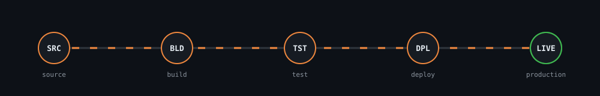

<div align="center">

[](https://linkedin.com/in/madushansivam)
[](https://madushansivam.github.io/portfolio/)
[](mailto:madushansivam@gmail.com)
[](https://github.com/madushansivam)


</div>

---

## 🧬 `$ cat /etc/madushan.yaml`

```yaml
# ─────────────────────────────────────────────────────────────
# /etc/madushan.yaml — DevOps Engineer Identity Config
# Last updated: 2026-07-23 | Version: 4.0.0 | Status: ACTIVE
# ─────────────────────────────────────────────────────────────

identity:
  name: Madushan Samayasivam
  role: DevOps Engineer
  location: Badulla, Sri Lanka
  email: madushansivam@gmail.com
  education: HNDIT @ SLIATE ATI Badulla (final year)
  studio: Nanmin Game Studio          # Founded — games are my creative lab

professional_stack:
  os:           Fedora Linux           # daily driver, not Ubuntu
  containers:   [ Docker, docker-compose ]
  ci_cd:        [ GitHub Actions, Jenkins ]
  cloud:        [ AWS, Azure ]
  scripting:    [ Bash, Python, Go, Rust ]
  monitoring:   [ learning: Prometheus, Grafana ]
  iac:          [ Terraform ]
  version_ctrl: [ Git ]
  web_server:   [ Nginx ]

currently_shipping:
  - infra-auditor-cli — Go concurrency + GitHub API auditing (Stage 1 of a 3-part trilogy)
  - AutoTest — autonomous LLM-driven web testing agent (final year project, shipped)
  - Kubernetes (k8s) — cluster fundamentals
  - German language (A1 to A2)

targets:
  short_term: DevOps internship (remote or on-site)
  long_term:  [ Germany, Sweden ]     # Europe — this is the mission

philosophy: "Automate the boring. Ship the meaningful. Build the unforgettable."
```

---

## ⚙️ `$ kubectl describe pipeline madushan-devops-workflow`



---

## 🐳 `$ cat Dockerfile.madushan`

```dockerfile
# =====================================================
#  Madushan Samayasivam — DevOps Engineer Build Image
#  Base: Fedora 44 | Arch: multi-platform
#  Verified live from my own machine — not a template guess
# =====================================================

FROM fedora:44 AS base

LABEL maintainer="madushansivam@gmail.com" \
      role="DevOps Engineer" \
      location="Sri Lanka" \
      studio="Nanmin Game Studio"

RUN dnf install -y \
    docker git bash python3 nginx curl \
    golang rust cargo nodejs npm python3-pip

COPY .github/workflows/*.yml /workspace/pipelines/
ENV GITHUB_ACTIONS=true CI=true

ENV STUDIO="Nanmin Game Studio"
ENV GAME_STACK="Vanilla JS Canvas · Three.js · GSAP · WebGL"

EXPOSE 9090    # Prometheus
EXPOSE 3000    # Grafana
EXPOSE 8080    # Application

CMD ["automate", "--everything", "--ship", "--never-stop-learning"]

# Build: docker build -t madushan:devops .
# Run:   docker run --rm madushan:devops
```

---

## 🔍 `$ ./verify-system.sh`

```
--- SYSTEM DEV TOOLS (checked live, not templated) ---
✅ docker:    Docker version 29.6.0, build 1.fc44
✅ terraform: Terraform v1.15.8
✅ python3:   Python 3.14.6
✅ pip3:      pip 26.0.1 (python 3.14)
✅ git:       git version 2.55.0
✅ node:      v22.22.2
✅ npm:       10.9.7
✅ go:        go version go1.26.4 linux/amd64
✅ rustc:     rustc 1.97.1 (8bab26f4f 2026-07-14)

# Run this exact check on your own machine. The version
# numbers and .fc44 build tags are what my Fedora box
# reports TODAY. Copy the colors all you want — you can't
# copy a live system fingerprint without owning the system.
```

---

## 🚢 `$ docker ps -a`

```bash
CONTAINER NAME              IMAGE              STATUS          PORTS / LINKS
──────────────────────────────────────────────────────────────────────────────
autotest                    node:llm-agent     Up · shipped    → github.com/madushansivam/autotest
infra-auditor-cli           golang:1.26        Building...     → Stage 1/3 of Go trilogy
imagesync                   js:webworker       Up 4 months     → github.io/imagesync
the-quiet-protocol          html5:game         Up 9 months     → APOGEE GameJam 2026
helapidi                    js:canvas          Building...     → github.com/Nanmin-Game-Studio
portfolio-site              html:gsap          Up 7 months     → madushansivam.github.io
──────────────────────────────────────────────────────────────────────────────
6 containers — 4 running, 2 building
```

---

## 📊 `$ gh api /stats/madushan`

<div align="center">

&nbsp;

</div>

<div align="center">

</div>

---

## 📈 `$ git log --graph --all`

<div align="center">

</div>

---

## 🤝 `$ curl -X POST /connect`

<div align="center">

[](https://linkedin.com/in/madushansivam)
[](https://madushansivam.github.io/portfolio/)
[](mailto:madushansivam@gmail.com)
[](https://github.com/madushansivam)

</div>

<div align="center">

*"Automate the boring. Ship the meaningful. Build the unforgettable."*

</div>
